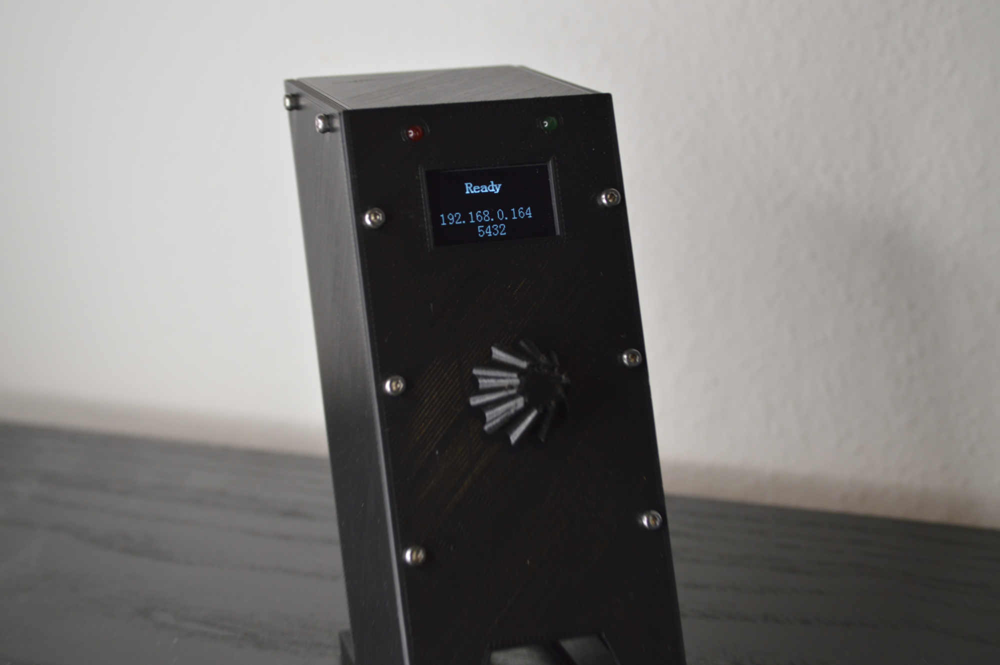
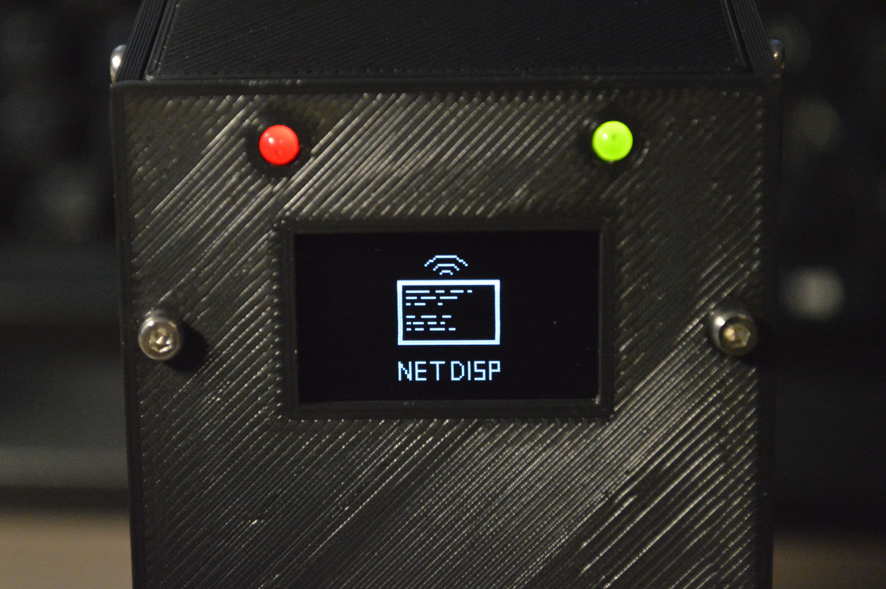
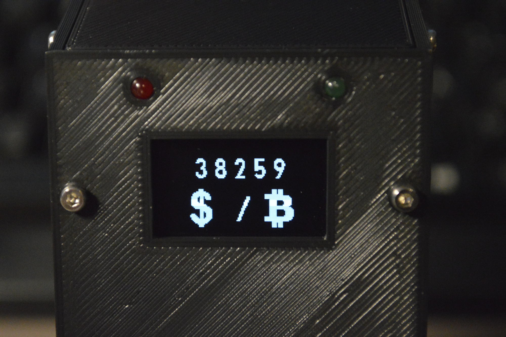

# NetDisp

* [Introduction](#introduction)
* [Building](#building)
* [Examples](#examples)
* [Notes](#notes)
* [Images](#images)

# Introduction

*NetDisp* is an ESP32 based wireless network display (currently only SSD1306)
that allows to show text and graphics received via UDP.

Data can be sent to the display either in form of an ASCII string, which will
show the data as (formatted) text or binary in form of specific commands
which also allows to control the LEDs or show images on the display. The
is display designed to be generic to allow various applications within the
same network to present information their information. For that the display
provides a set of virtual displays that can either be manually selected or
via commands send to the display. Each virtual display can be individually
updated and controlled even if it is currently not visible.

After starting up and estabilishing a wireless connection the display will
show "Ready" together with it's IP address and port (see [images](#images)).
The display is now ready to receive commands, this can be done for example
using netcat:
```bash
echo "Hello World" | nc -b -w 0 -u <ip> <port>
```

Alternatively also a python implementation is provided to control the display:
```python
from netdisp import NetDisp
netdisp = NetDisp("<ip>", "<port>")

netdisp.show_text("Hello World").send()
netdisp.show_image(0, 0, 128, 64, "/path/to/image").send()
```

# Building

## Software
This project uses [ESP-IDF](https://github.com/espressif/esp-idf) as
the development framework, to build the project it is required to have
ESP-IDF installed.

Clone the project:
```bash
git clone --recursive https://github.com/Manewing/netdisp.git
```

To build simply run:
```bash
source <path/to/esp-idf>/export.sh
cd netdisp/
idf.py build
```

### Python

Install the requirements:
```bash
pip install -r requirements.txt
```

Running build will also copy the python files to the build directory, these
can be dynamically added to the environment by running:
```bash
source build/exports
# "import netdisp" should now work
```

### Configuration

The *NetDisp* project can be configured by running:
```bash
idf.py menuconfig
```

This allows to set configuration values such as the SSID and password of the
WLAN access point to use or the used GPIO pins.

## Hardware

**Components:**
- 0.96" 128x64 SSD1306 OLED
- ESP32 NodeMCU Modul
- Rotary Click Encoder Module KY-040
- 3D Printed Casing and Nob
- Green and Red 3mm LED
- M2 Screws: 4\*M2 x 4mm, 22\*M2 x 10mm

The STL models for 3D printing can be found in the folder `3d_models`. In the
folder is also a Fusion 360 export of the project.

# Examples

Example applications can be found in the sub-folder `examples/` these include:
- A Crypto Currency Tracker
- A System Monitor
- Simple text and formatting

# Notes

- At the momemnt the display does not provide any form of authentication or
security. This means **anyone** in the network can control it.
- This project is inspired by
[this](https://hackaday.io/project/170500-esp8266-network-display)
project from hackaday.io

# Images

<div style="text-align: center">




</div>